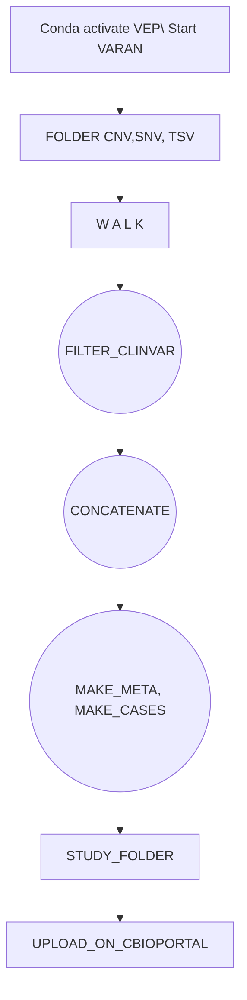
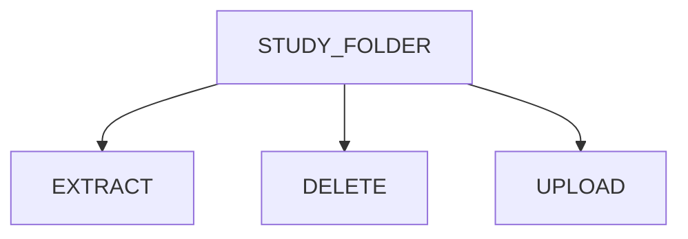

[](https://zenodo.org/doi/10.5281/zenodo.10075905)

# Varan-Release


# VARAN 2.0


## Introduction  

<p align="justify">
Varan 2.0 is a Python-based application that provides a pipeline to automatically prepare cancer genomics data in the specific format supported by the <a href="https://www.cbioportal.org/">cBioPortal</a>.<br>
Specifically, starting with a folder containing the vcf files, this application can create a study folder ready to be uploaded to cBioPortal.<br>
This application also gives the possibility to work on existing study folder, with following features:

* update a study folder by adding new samples 
* extract a list of samples
* remove a list of samples <br>

## Versioning 

<p align="justify">Varan offers an innovative way to track changes inside study folder. For this reason, each study folder name will be accompanied by the version number (i.e output_folder_name_v1, output_folder_name_v2,...).
Each change will also be reported in a report file that will be written inside the newer version.


Click  <a  href="https://github.com/bioinformatics-policlinicogemelli/Varan-Release/blob/main/cBioPortal%20docker%20install.md"> here</a> for more information on the steps for cBioportal installation.
 
## Installation procedure : Varan 

#### <u>installation on local system</u>

### Prerequisites
* <b>Python</b><p align="justify">  Tested version: 3.9.2

* <b>Variant Effect Predictor (VEP)</b><p align="justify">The Variant Effect Predictor <a href="https://www.ensembl.org/info/docs/tools/vep/index.html">VEP</a> is a tool used to determine the effect of variants (SNPs, insertions, deletions, CNVs or structural variants) on genes, transcripts, and protein sequence, as well as regulatory regions. <br>The steps to install VEP can be found <a href="https://www.ensembl.org/info/docs/tools/vep/script/vep_download.html"> here</a>, while DB and FASTA files can be downloaded <a href="http://www.ensembl.org/info/docs/tools/vep/script/vep_cache.html#cache)"> here</a>. Latest version of clinvar filter can be downloaded for <a href="https://ftp.ncbi.nlm.nih.gov/pub/clinvar/vcf_GRCh37"> GRCh37</a> (Genome Reference Consortium Human Build 37 Organism) or for <a href="https://ftp.ncbi.nlm.nih.gov/pub/clinvar/vcf_GRCh38"> GRCh38</a> (Genome Reference Consortium Human Build 38 Organism). Older versions can be found <a href="https://ftp.ncbi.nlm.nih.gov/pub/clinvar"> here</a>.
<br> --> Tested version: 110

* <b>vcf2maf</b><br><p align="justify"><a href="https://github.com/mskcc/vcf2maf/tree/main">vcf2maf</a> is the tool required for the conversion of vcf files in maf format ones. 
<br>All the installation info can be found <a href="https://github.com/mskcc/vcf2maf/tree/main">here</a>
<br> --> Tested version: 1.6.21

* <b>Samtools</b> <br><p align="justify"><a href="https://www.htslib.org/">Samtools</a> is a suite of programs for interacting with high-throughput sequencing data. 
<br>All the installation info for samtools and its libraries htslib and bcftools can be found <a href="https://www.htslib.org/download/">here</a>
<br> --> Tested version: 1.18


To correctly install and use Varan :
1. Open a terminal
2. Digit the following command to clone the repository folder: 
```
git clone https://github.com/bioinformatics-policlinicogemelli/Varan-Release
```
3.  Install all of the packages required
```
cd <varan_folder_path>/varan_release
pip install -r requirements.txt
```
<p align="justify">
⚠️ <i>Depending on the python version it may be necessary to use pip3 instead of pip. </i>

To test the installation and check if everything works, launch the main script <b>varan.py</b> in the folder Varan-Release : 

```
cd <varan_folder_path>/Varan-Release
python varan.py -i Test_Varan_Folder -c test -o study_test
```
⚠️ <i>Depending on the python version it may be necessary to use pip3 instead of pip</i><br><be>

If everything works, the study folder study_test will be created.

<p align="justify">
⚠️ <i>If any error is printed while launching varan.py, check if step 3 completed without errors</i>

## Create a Virtual Environment with Conda or Miniconda

#### <u>installation on virtual environment</u>

This type of installation has been tested on:

* Mac Intel models


1. **Install Conda or Miniconda:**

   - If you don't have Anaconda installed, you can download and install Miniconda from the official website: [Anaconda](https://anaconda.org).
   - Make sure to follow the installation instructions for your specific operating system.

2. **Open your terminal or shell.**

3. **Create a new virtual environment:**

   - To create a new virtual environment, you can use the following Conda command:

     ```bash
     conda env create -f environment.yml -p ./varan_env     ```

4. **Activate the virtual environment:**

   - To activate the newly created virtual environment, use the following command:


    ```bash
       conda activate ./varan_env
      ```

5. Once inside the virtual environment, the installation can be checked, following the same procedure explained in local installation.

<p align="justify">⚠️ <i>Mac Apple Silicon M1-M2 model have shown different problems with this kind of procedure. It is strongly recommended to use a local installation.</i>


## Usage

<p align="justify">The first step to start using Varan is to correctly set the configuration file *conf.ini*. This file is divided in 6 subsessions:

* <p align="justify">Paths: here is possible to specify Vep, vcf2maf and fasta paths and (optional) ClinVar db.
* <p align="justify">Project: here is possible to specify project info like name, description and profile
* <p align="justify">Filters: here are specified the filters applied in the filtering step
* <p align="justify">Cna: here are specified the CNV gene names
* <p align="justify">TMB: here are specified the TMB thresholds
* <p align="justify">MSI: here are specified the MSI thresholds

<p align="justify">Varan application can be divided into two separate main blocks that require different inputs and ensure different operations to perform on them. The first block contains the functions to create a new study folder ex-novo, while the second one contains the functions to modify (Update/Extract/Remove samples) an existing study folder.

Here below are reported the steps and the options to set to run each block.

### Block One: Create Study Folder ex-Novo

#### Workflow



#### 1. Preparing Input

<p align="justify">
To create a new study folder, the user must give .vcf files as input to the program.
This can be done as follows:

<b>Folder</b>: user must organize a folder containing all of the vcf files and a csv file where the patient IDs and samples IDs are listed. The structure of this folder have to follow the one reported below </li>

```
input_folder/
├── CNV
│   ├── 001.vcf
│   ├── 002.vcf
|   ├── ...
│   └── 010.vcf
├── SNV
│   ├── 001.vcf
│   ├── 002.vcf
|   ├── ...
│   └── 010.vcf
├── CombinedOutput
│   ├── 001_CombinedVariantOutput.tsv
│   ├── 002_CombinedVariantOutput.tsv
|   ├── ...
│   └── 010_CombinedVariantOutput.tsv
└── patients.tsv
```
Where:
* <p align="justify">*CombinedVariantOutput.tsv* is a tsv file that is necessary to TMB, MSI and Fusions evaluation and that has to contain [TMB], [MSI] and [Fusions] fields. It has to be named as *PatientID_CombinedVariantOutput.tsv*

* <p align="justify">*patients.tsv* is a tsv file that is necessary to map tha sample ID to the patient ID. It has to be structured as a two columns tables with "PatientID" and "SampleID" fields.

⚠️ *An example of both input types can be found in the **Test_Folder_Varan** folder*

#### 2. Launch Varan main

These are the options that can be set for this block:

| Options | Description | Type | Required
|-------------------------|----------------| :---:| :---:|
|-o <br> --output_folder| <p align="justify">Add this option to insert the path where to save the output folder| string | Yes
|-i <br> --input| <p align="justify">Add this option to insert the path to the input tsv file where the vcf files are listed|  | No
|-c <br> --cancer| <p align="justify">Add this option to specify a cancer type| string | No
|-f <br> --filter_snv| <p align="justify">Add this option to filter out from the vcf the variants with dot (.) and PASS in Alt and Filter column respectively |boolean| No
|-t <br> --vcf_type|<p align="justify">Add this option to specify the type of vcf (snv/cnv) |string|Only if the -i option is selected
|-v <br> --vus| <p align="justify">Add this option to filter out VUS variants | boolean | No

**Example:**

<ins>vcf file input - SNV </ins>: Launch this command to perform a filtering on vcf files, a filter on VUS variants and save (or rewrite) a study folder starting from a file listing snv vcf files.
```
python varan.py -i <path_to_vfc_tsv_file> -c <cancer_name> -t snv -f -v -o <path_to_output_folder> 
```
<ins>vcf file input - CNV </ins>: Launch this command to perform a filtering on vcf files, a filter on VUS variants and save (or rewrite) a study folder starting from a file listing cnv vcf files.
```
python varan.py -i <path_to_vfc_tsv_file> -c <cancer_name> -t cnv -f -v -o <path_to_output_folder> 


#### 3. Output

After varan.py has run successfully, the resulted output folder should have the following organization and content:
```
cancer_name
├── data_clinical_sample.xlsx
├── case_lists
│   ├── cases_cna.txt
│   ├── cases_sequenced.txt
│   └── cases_sv.txt
├── data_clinical_patient.txt
├── data_clinical_sample.txt
├── data_cna.txt
├── data_cna_hg19.seg
├── data_mutations_extended.txt
├── data_sv.txt
├── meta_clinical_patient.txt
├── meta_clinical_sample.txt
├── meta_cna.txt
├── meta_cna_hg19_seg.txt
├── meta_mutations_extended.txt
├── meta_study.txt
└── meta_sv.txt
```
<p align="justify">
 The description of the file formats that cancer study data should assume in order to be successfully imported into the database can be consulted at this link <a href="https://github.com/cBioPortal/cbioportal/blob/master/docs/File-Formats.md#introduction">here</a>


### Block Two: Modify Existing Study Folder
#### Workflow

#### 1. Preparing Input

<p align="justify">The input for this block is a study folder correctly populated. It can be the output of the first block or an already existing folder. Its structure has to follow the one reported in the output paragraph. 

#### 2. Launch Varan main

These are the options that can be set for this block:

| Options | Input | Type | Required
|----------------|----------------| :---:| :---:|
|-o <br> --output_folder| <p align="justify">Add this option to insert the path where to save the output folder| string | Yes
|-u <br> --Update| <p align="justify">Add this option if you want to update an existing study folder| boolean | No
|-r <br> --Remove| <p align="justify">Add this option if you want to remove samples from an existing study folder| boolean | No
|-e <br> --Extract| <p align="justify">Add this option if you want to extract samples from an existing study folder| boolean | No
|-p <br> --Path| <p align="justify">Add this option to insert the path to the already existing study folder to update or from where remove/extract samples | string | Only if the -u, -r or -e option is selected
|-n <br> --NewPath| <p align="justify">Add this option to insert the path where to save the updated study folder | string | Only if the -u option is selected
|-s <br> --SampleList| <p align="justify">Add this option to insert the path to the txt file containing the list of samples to remove/extract from an existing study folder| string | Only if the -r or -e option is selected


**Example:**

<p align="justify">
<ins>sample update</ins>: Launch this command to update a study folder by inserting or updating clinical and samples info and to save a new updated one in the output path.

```
python varan.py -u -p <path_to_old_study_folder> -n <path_to_new_study_folder> -o <path_to_output_folder>
```
<p align="justify">
<ins>sample removal</ins>: Launch this command to remove a list of samples from a study folder and to save a new one without the removed samples in the output path.

```
python varan.py -r -p <path_to_study_folder> -s <path_to_sample_list_file> -o <path_to_output_folder>
```
<p align="justify">
<ins>sample extraction</ins>: Launch this command to extract a list of samples from a study folder and to save a new one containing the extracted samples only in the output path.

```
python varan.py -e -p <path_to_study_folder> -s <path_to_sample_list_file> -o <path_to_output_folder>
```
#### 3. Output

<p align="justify">
After varan.py has run successfully, a resulted output folder will be created and will contain the modified files.  The folder organization will be the same as the one reported in the ouput paragraph of the block one.
